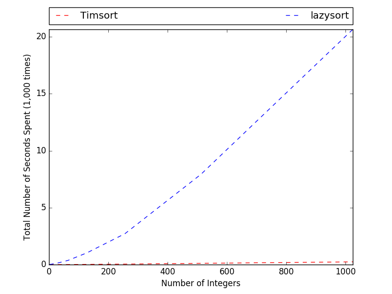

# lazysort
> _In programming language theory, lazy evaluation, or call-by-need is an evaluation strategy which delays the
> evaluation of an expression until its value is needed (non-strict evaluation)._
> https://en.wikipedia.org/wiki/Lazy_evaluation

lazysort is a sorting algorithm that procrastinates doing work as much as possible.

## How lazysort works?
lazysort uses a modified version of [dropsort](http://www.dangermouse.net/esoteric/dropsort.html), a "lossy" sorting
algorithm, which keeps the "dropped" items in a separate list (called _surplus_).

lazysort starts by dropsorting the _main_ list, which also yields a _surplus_ list, which is also a list. The surplus
list is, then, treated as another _main_ list and sorted again using the modified dropsort algorithm, which yields
another _surplus_ list and the process is repeated until the last _surplus_ list is empty. Afterwards, starting from the
last _surplus_ list every _surplus_ list is _merged_ with its _main_ list, the result might be another _surplus_ list
which is to be merged with its _main_ list. For _merging_,
[`heapq.merge()`](https://docs.python.org/3/library/heapq.html#heapq.merge), which
"merges multiple sorted inputs into a single sorted output" by returning an iterator, is used.

A simplified (non-lazy) version of lazysort is shown below (the real version uses generators for truly lazy-evaluation):
```
import typing


def lazysort(l: list) -> list:
    # Stage 1
    stack = []
    current_list = l
    while current_list:
        main, surplus = dropsort(current_list)
        stack.append(main)
        current_list = surplus

    # Stage 2
    while len(stack) >= 2:
        stack.append(merge(stack.pop(), stack.pop()))

    return list(stack.pop())


def dropsort(l: list) -> typing.Tuple[list, list]:
    result = [l[0]]
    surplus = []
    for i in range(1, len(l)):
        if l[i] >= result[-1]:
            result.append(l[i])
        else:
            surplus.append(l[i])

    return result, surplus
```

You can always have a look at the source code for the real implementation.

## Benchmark
The benchmark is done under the following conditions:

* Python 3.5.2
    * Matplotlib 1.5.3
* Windows 10.0.14393 Home Single Language x64 (Build 14393)
* Intel Core i5-4210U on Lenovo Z50-70

__Sorting _n_ integers in range [0, 255]__


As can be seen from the results, lazysort do not scale.

## License
> This is free and unencumbered software released into the public domain.
>
> Anyone is free to copy, modify, publish, use, compile, sell, or
> distribute this software, either in source code form or as a compiled
> binary, for any purpose, commercial or non-commercial, and by any
> means.
>
> In jurisdictions that recognize copyright laws, the author or authors
> of this software dedicate any and all copyright interest in the
> software to the public domain. We make this dedication for the benefit
> of the public at large and to the detriment of our heirs and
> successors. We intend this dedication to be an overt act of
> relinquishment in perpetuity of all present and future rights to this
> software under copyright law.
>
> THE SOFTWARE IS PROVIDED "AS IS", WITHOUT WARRANTY OF ANY KIND,
> EXPRESS OR IMPLIED, INCLUDING BUT NOT LIMITED TO THE WARRANTIES OF
> MERCHANTABILITY, FITNESS FOR A PARTICULAR PURPOSE AND NONINFRINGEMENT.
> IN NO EVENT SHALL THE AUTHORS BE LIABLE FOR ANY CLAIM, DAMAGES OR
> OTHER LIABILITY, WHETHER IN AN ACTION OF CONTRACT, TORT OR OTHERWISE,
> ARISING FROM, OUT OF OR IN CONNECTION WITH THE SOFTWARE OR THE USE OR
> OTHER DEALINGS IN THE SOFTWARE.
>
> For more information, please refer to <http://unlicense.org>

## Who?
Bora M. Alper \<bora@boramalper.org>
